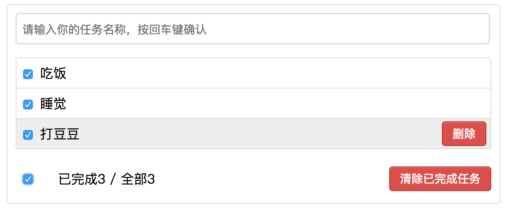

# Vue_todoList_demo

> vue 的 todolist 项目练习

## 效果图: 


## 项目实现流程
## 1.拆分页面，提取组件 
* 分析页面结构，根据页面拆分提取组件
    * 一共需要定义5个组件
        * app主组件
            * header组件
            * list组件
                * item组件
            * footer组件
## 2.编写静态组件并使用
 * 将页面静态资源html，css，分别提取到相对应的组件中(注意组件间的关系)
## 3.初始化数据，动态显示初始化界面

* 注意引入内部组件的时候需要将组件映射成标签

        components:{
            item
        }
* 外部组件向内部组件传递属性的时候，内部组件需要声明接受属性
       
       props:['todos']
       或者
       props:{ todo:Object }
       
* 注意双向数据绑定
        
        <input type="checkbox" v-model="todo.complete"/>
## 4.实现与用户的交互操作
* 添加todo

* 添加完成

    * 定义数据在哪个组件，修改数据的方法就在哪个组件
    * 向内部组件传递方法的时候注意写法
    
           :add='add'
    * 内部组件声明接收属性的时候可以定义属性的类型和必要性
            
            props:{
                  add:Function,
                  required:true
            }
    * 注意检查不合法的输入，包括空格
* 鼠标移入移出和删除按钮显示隐藏的效果

    * 为组件添加样式属性
            
            :style="{background:bgColor}
    * 为组件添加鼠标移入移出事件，使用同一个函数，便于控制
            
            @mouseenter="showBtn(true)" @mouseleave="showBtn(false)"
    * 为按钮的显示隐藏添加属性
            
            v-show="isShow"
    * 当鼠标移入时改变背景色和按钮的显示隐藏
            
            showBtn(isShow){
                this.isShow = isShow;
                this.bgColor = isShow ? '#eee':'white'
            }

    
* 删除todo，选中todo时，底部删除已完成按钮显示
    
    * 注意组件间传递属性方法，子组件每一层都要传递，每一层都要声明使用
* footer组件
    * 已完成／全部 的数量统计(已完成有两种方法) 

        * filter --> 会产生一个新数组
        * reduce --> 统计，性能更高
        
                completeTodo(){
                    //filter 会返回一个新数组
                  //return this.todos.filter(todo => todo.complete).length
                  return this.todos.reduce((preTotal,todo)=>{
                    return preTotal + (todo.complete?1:0)
                    //最后遍历的元素返回的结果就是reduce的返回值
                  },0)
                }
                
                //reduce的原理
                          var total = 0
                          for(var i = 0; i < todos.length; i++){
                              var todo = todos[i];
                //              if(todo.complete){
                //                total++
                //              }
                            total += todo.complete ? 1 : 0
                          }
    * 清除已完成任务按钮的显示隐藏
        * 根据判断计算属性completeTodo的长度，当有选中的时候显示，否则隐藏
    * 清除已完成任务
        * 注意如果传入的属性名为驼峰命名法，需要改为xxx－yyy的形式，但是声明接收属性时依然是驼峰命名法
                
                :remove-selected="removeSelected"
                
                props:['todos','removeSelected'],
        * 传入组件的方法可以直接调用使用
        
                <button class="btn btn-danger" v-show="completeTodo>0"
                 @click="removeSelected">清除已完成任务</button>
    * 全选按钮
        * 对全选按钮进行双向数据绑定，操作全选按钮 <=> 操作列表
            * 设置get和set方法
            
                    allComplete:{
                        get(){
                          return this.completeTodo === this.todos.length && this.completeTodo != 0
                        },
                        set(value){
                          //根据新值设置全选或者全不选
                          this.selectAllTodos(value)
                        }
                    }
                    
        * 定义全选全不选的方法
                
                selectAllTodos(isCheck){
                      this.todos.forEach(todo=>{
                          todo.complete = isCheck
                      })
                  }
        * 注意全部删除后全选会选中，这时需要设置判断条件 
        
                
                this.completeTodo != 0
* 数据存储：刷新页面数据仍存在

    * 定义一个工具模块localStorageUtil,默认暴露一个对象，在其中定义读取和保存数据的方法
          
          /**
           * localStorage 数据存储工具模块
           * 函数模块：只提供一个功能
           * 对象模块：提供多个功能
           */
          const TODOS_KEY = 'todos_key'
          export default {
            readTodos(){ //如果没有数据，返回［ ］
              return JSON.parse(localStorage.getItem(TODOS_KEY) || '[]')
            },
            saveTodos(todos){//先将todos转换为JSON再保存
              localStorage.setItem(TODOS_KEY,JSON.stringify(todos))
            }
          }

## Build Setup

``` bash
# install dependencies
npm install

# serve with hot reload at localhost:8080
npm run dev

# build for production with minification
npm run build

# build for production and view the bundle analyzer report
npm run build --report
```

For detailed explanation on how things work, checkout the [guide](http://vuejs-templates.github.io/webpack/) and [docs for vue-loader](http://vuejs.github.io/vue-loader).
